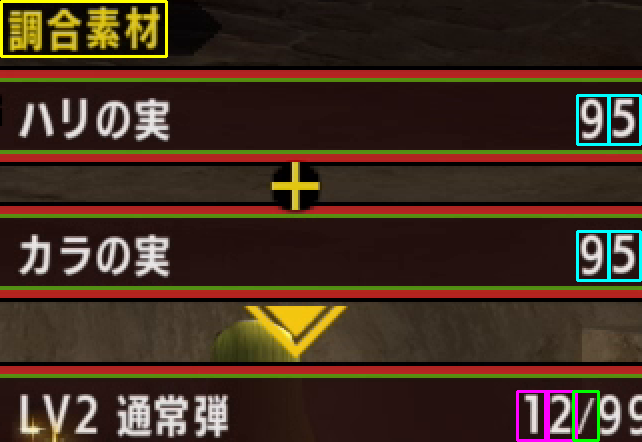
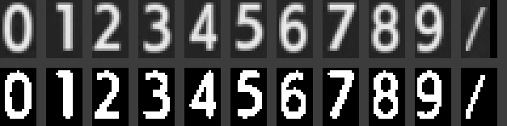

# 仕組み

調合の動画から乱数位置を割り出すまでに、何をしているかの解説。
ビルドやテストの手順は [development.md](development.md) を参照。

## 全体の流れ

```
動画 (mp4)
  │  ① デコードして ROI を切り出す        src/workers/analyze.worker.ts
  ▼
ROI の RGBA (321x221)
  │  ② コマごとに数字を読む               combo-core/src/read.rs
  ▼
コマごとの [素材1, 素材2, 完成品]
  │  ③ 素材の減りと完成品の増えを突き合わせる  combo-core/src/cross.rs
  ▼
累計の並び  00 04 07 09 12 …
  │  ④ 乱数列から同じ並びを探す            combo-core/src/search.rs
  ▼
調合開始時のフレーム位置
```

①だけが TypeScript で、②〜④は Rust を WebAssembly にしたもの。
②はそのコマだけを見て、③は並び全体を見る。この分担が全体の骨格になっている。

## ① 動画から ROI を切り出す

mediabunny で mp4 を読み、WebCodecs でコマにする。提示順に全コマを受け取るので、
シークによる取りこぼしや重複が起きない。

各コマから切り出すのは、下の枠を全部含む最小の矩形（`x=513, y=49, 321x221`）だけ。
画面全体の約 1/13 で、読み戻すデータ量がそのぶん減る。



| 枠の色 | 見ているもの | 使い道 |
|---|---|---|
| 黄 | 「調合素材」の見出し | 調合画面かどうかの判定 |
| 水色 | 素材1・素材2の数字 | 調合回数を数える |
| ピンク | 完成品の数字 | 生産数を読む |
| 緑 | 「/」 | 調合画面かどうかの判定（補助） |

座標は `read.rs` が持っていて、TS は `Session.roi()` で矩形を受け取るだけ。
画面のどこに何があるかを TS は知らない。

## ② 1 コマの読み取り

### 見本

`combo-core/templates/` に 0〜9 と「/」「調合素材」の見本がある。
これは 3 本の録画から、正解が分かっているコマを数十〜数百枚集めて、
ピクセルごとに中央値を取って作ったもの。1 枚だけから作るより圧縮ノイズが打ち消される。



上段が見本そのもの、下段が照合に使う二値化後の形。
**二値化はビルド時に済ませて Rust のソースに埋め込む**ので（`build.rs`）、
実行時に PNG を展開する必要がなく、wasm にデコーダも入らない。

### 1 スロットの読み方

数字 1 文字ぶんの枠を「スロット」と呼ぶ。10 の位と 1 の位で 2 つある。

```
1. スロットを切り出して、色チャンネルの最大値を明るさにする
2. 明暗差（最大 − 最小）が 50 未満なら「空白」で終わり
3. 最小と最大のちょうど中間をしきい値にして二値化
4. 上下左右に ±1px ずらした 9 通り × 見本 0〜9 の全組み合わせで不一致率を計算
5. 一番小さい不一致率の見本を答えにする（20% を超えたら「読めない」）
```

**しきい値を固定せず、スロットごとに中間を取る**のがポイント。
こうすると、白い数字でも、上限時に出る暗い赤の数字でも、同じ形の白黒画像になる。

| 対象 | 明暗差 | 結果 |
|---|---|---|
| 白い数字 | 30 → 240 | 二値化して照合 |
| 暗い赤の数字 | 32 → 123 | 二値化すると白い数字と同じ形になる |
| 空白 | 32 → 38 | 明暗差が小さいので空白扱い |

**±1px ずらすのは、録画の圧縮で文字の位置がわずかに動くため。** 9 通り試して一番合う位置を使う。

色チャンネルの最大値を明るさにしているので、**チャンネルの並び順に依存しない。**
ブラウザが RGBA で渡しても、他の順序でも同じ値になる。

### 調合画面かどうか

「調合素材」の見出しと「/」を、それぞれの見本と照合する。
**両方とも不一致率が 15% 以下のときだけ**調合画面とみなす。
タイトル画面やロード中のコマはここで捨てられる。

見出しは調合パネルが開いている間ずっと出ていて、似た形が他で出ることもまずないので判定の主役。
「/」は単体だと別の画面の斜線に似ることがあるため、補助として使う。

### 打ち切り

完成品が 99（所持上限）になったら、それ以上調合できないので読み取りを終了する。
99 に達した後に出るポップアップを誤読する心配もなくなる。

## ③ クロスチェック

ここからは読み終わった数値の並びだけを使う。基本の考え方は、
**調合の回数は素材の減りで数え、1 回あたりの個数は完成品の増えで読む**こと。
素材は 1 回の調合で必ず 1 個ずつ減るので回数を数えるのに向いていて、
完成品は増え方が 2〜4 個とばらつくので個数を知るのに使う。

### コマの並びの例

素材が先に変わり、1 コマ遅れて完成品が変わる。

| 時刻 | 素材1 | 素材2 | 完成品 | 区間 |
|---:|---:|---:|---:|---|
| 24.31s | 99 | 99 | 0 | 素材99の区間（最後の完成品 0） |
| 24.34s | 98 | 98 | 0 | 素材98の区間 |
| 24.37s | 98 | 98 | 3 | 〃（最後の完成品 3） |
| 24.87s | 97 | 97 | 3 | 素材97の区間 |
| 24.91s | 97 | 97 | 5 | 〃（最後の完成品 5） |

### 手順

```
1. 素材1と素材2から素材の値を決める
     一致していればその値。食い違ったら、前の値以下の方を採用
     素材が前より増えていたら、
       2 つの表示が揃っていれば別の調合が始まったとみなして数え直す
       揃っていなければ読み間違いとして捨てる
2. 素材の値が変わるたびに区間を区切る
     各区間では「その区間で最後に読めた完成品の値」を覚えておく
3. 隣り合う区間ごとに比べる
     調合回数 k = 前の区間の素材 − 次の区間の素材
     増加量  n = 次の区間の完成品 − 前の区間の完成品
4. n を k 回の調合（各 2〜4 個）に割り振る
```

「最後に読めた完成品の値」を使うのは、**完成品の表示が素材より 1 コマ遅れるため。**
区間の最初のコマではまだ前の値が出ているので、最後の値を取れば必ずその区間の結果になる。

### 別の調合が始まったとき

1 回の調合で素材が増えることはないので、**素材が増えていれば調合をやり直している。**
動画の冒頭に前の調合の結果が映っていることがあり、そのまま数えると本番の素材が
「増えた」ことになって以降すべて捨ててしまう。2 つの表示が揃って増えているなら
別の調合とみなし、そこから数え直す。

同じ理由で、**完成品が上限に達したかどうかも 1 コマでは決まらない。**
冒頭に映った前の結果が上限だと、そこで解析を打ち切ってしまう。
上限未満を見たあとの上限だけを到達とみなす（`read.rs` の `reached_cap`）。

### 割り振りの結果

割り振り方は 5 通りに分類され、`Resolution` として返る。

| 状況 | 種別 | 表示 |
|---|---|---|
| k=1、n が 2〜4 | `exact` | `3` |
| n=0（素材は減ったのに完成品が増えていない） | — | 見落としとみなし、次の区間とまとめる |
| k≥2、割り振りが 1 通り | `inferred` | `2 2` |
| k≥2、割り振りが複数 | `ambiguous` | `[2+4\|3+3\|4+2]` |
| 完成品が 99 に到達 | `capped` | `1` など |
| どう割り振っても説明できない | `failed` | エラー |

候補を 1 つに決めつけないのは、**あとで乱数と照合するときに候補ごとに試せば自然に絞れる**から。
ただし現在は、候補が残ったまま（累計に `??` がある）だと検索できない。

## ④ 乱数位置の検索

### 乱数と時間の関係

MHXX の乱数は xorshift128 で、**1 コマ（1/30 秒）ごとに 1 回進む。**
だから乱数を進めた回数は、ゲーム開始からの経過フレーム数そのものになる。

調合すると、それに加えて乱数を消費する。実測した調合の間隔は 3 コマ（0.1 秒）で、
**1 回の調合につき合計 5 進む**（3 コマ分の経過 + 調合による 2）。
検索が 5 つおきに乱数を拾うのはこのため。

**ボタンを押しっぱなしにして連続で調合する必要がある**のは、この 3 コマ間隔が前提だから。
間隔が変わると刻みが崩れて一致しなくなる。

### 生産数の決まり方

乱数の下位 16 ビットを 100 で割った余りで決まる。

```
 0〜24 → 2 個
25〜74 → 3 個
75〜99 → 4 個
```

つまり生産数 1 個あたり **1.5 ビット**の情報しかない。

### 探し方

累計の並びから差分列（各回の生産数）を作り、乱数列を前から舐めて同じ並びを探す。

```
累計     00 04 07 09 12 15 …
差分         4  3  2  3  3 …   ← これを探す
```

- **先頭 3 つと末尾の 99 は落とす。** 調合開始前の乱数消費と噛み合わないため
- **KMP 法を 5 本並行で回す。** 5 つおきに拾うので、位相ごとに状態を持つ
- **`jump()` で任意の位置へ一気に飛べる。** 多項式のべき乗を使うので、
  開始位置を 10 億にしても一瞬で状態が求まる
- 見つかった位置は、調合が消費したぶんを差し引いて**経過フレーム数に戻す**

### 偽陽性

差分 1 個が 1.5 ビットなので、差分 *n* 個の並びが偶然一致する確率は約 2<sup>−1.5n</sup>。
範囲 *N* を探すときの偽陽性の期待値は *N* / 2<sup>1.5n</sup> になる。

実測値（10<sup>8</sup> の範囲で探した場合）:

| 差分の個数 | 情報量 | ヒット数 |
|---:|---:|---:|
| 3 | 5 bit | 6,247,128 |
| 7 | 11 bit | 97,247 |
| 11 | 17 bit | 1,505 |
| 15 | 23 bit | 17 |
| 19 | 29 bit | 1 |
| 31 | 47 bit | 1 |

**範囲を 10 倍に広げるのに必要な調合は 2 回だけ。** 範囲を絞るより調合回数を稼ぐほうが効く。
目安は「差分の個数 × 1.5 ≧ log<sub>2</sub>(範囲)」。

## ⑤ ずれの診断

通常の検索で見つからないとき、**途中で乱数の進み方がずれた可能性**を調べる。
ずれは前にも後ろにも起こりうる。

差分列の一部でもずれていると全体としては一致しないが、**ずれをまたがない区間**は
そのまま一致する。そこで並びを重なり合う窓に切り、窓ごとに探す。

```
1. 差分列を長さ 12 の窓に切る（[0..12] [1..13] … と 1 個ずつずらす）
2. 全部の窓を 1 回の走査で同時に探し、「差分の先頭が来る位置」に換算する
3. 同じ位置を 2 つ以上の窓が指したら候補にする
4. 候補から乱数を順に照合し、合わなくなったら ±1、±2 のずれを試して記録する
5. 最後まで合わせられた候補のうち、ずれが最も少ないものを採用する
```

窓の長さが検出できるずれの間隔を決める。ずれの前後どちらかに 12 個の差分が
連続して残っていないと、位置を拾えない。長くすると偽の候補は減るが、
ずれが真ん中にある並びを取りこぼす。

窓ごとに乱数列を舐め直すと窓の数だけ時間が掛かる。生産数は 2〜4 の **3 通り**しか
ないので、直近 12 個を 3 進数 1 つ（3<sup>12</sup> 通り）に畳んで表を引けば、
**全部の窓を 1 回の走査で**同時に照合できる。KMP と違い窓の数に依存しない。

ずれ幅を確定するときは 3 個先まで一致を確認する。1 個だけ見ると、
偶然合った位置を掴んでしまう（3 通りしかないので 1/3 で当たる）。

先頭でいきなりずれる場合は、**基準の位置がずれているのと区別が付かない**ので、
ずれとして数えずに基準そのものを動かす。同じ理由で「何回目の調合でずれたか」も
一意には決まらない（ずれた直後の生産数がたまたま一致すると、その先にずれ込む）。
**決まるのは位置とずれの合計だけ**で、報告値に足し戻せば同じ答えになる。

ずれが打ち消し合っていれば合計は 0 になり、報告値に補正は要らない。

**先頭の 1 個だけが合わない場合は、ずれではなく捨て方の問題として扱う。**
③ で先頭 3 回を捨てているが、これが足りないことがある。外した残りが全部一致するなら
外して位置を決め、ずれは 0 として報告する。報告値の式は捨てた回数に依存しないので、
どちらで数えても同じ値になる。

### 診断が耐えられる範囲

ずれの位置と幅を選べるぶん、診断は通常の検索より偽の候補に弱い。ずれ 1 箇所につき
「どこで」(差分の個数) × 「どれだけ」(±1、±2 の 4 通り) の自由度があるので、
差分が 28 個なら 1 箇所で約 7 bit、2 箇所で約 13 bit ぶん余裕を失う。

28 個の差分が持つ情報は 42 bit なので、10<sup>9</sup> (30 bit) を探すと
2 箇所ずれの偽の候補が出てくる計算になる。`tests/cases/drift-4` で実際にそうなる。

**採用順をずれの少ない順にしているのはこのため。**票の多い順にすると、票が 1 つ多いだけの
偽の候補に負ける。ずれが少ない説明ほど確からしいという順序なら、この場合でも正解が残る。

**このずれが何なのかは分からない。** ゲーム側で乱数が余分に進んだのか、
数値を読み違えた結果そう見えているだけなのかを区別する手段はない。
読み違えは「ずれ」の形にならないので、その場合は候補が見つかっても照合が通らず、
答えを出さない。

## 調整できる数値

| 名前 | 値 | 置き場所 | 意味 |
|---|---:|---|---|
| `MIN_CONTRAST` | 50 | `read.rs` | 明暗差がこれ未満なら空白 |
| `MAX_DIST` | 20% | `read.rs` | 数字の不一致率がこれを超えたら読めない |
| `MAX_DIST_MARK` | 15% | `read.rs` | 見出し・「/」がこれを超えたら調合画面ではない |
| `ROI` | 513,49,321,221 | `read.rs` | TS が切り出す矩形 |
| `SOURCE` | 1280x720 | `read.rs` | 受け付けるコマの大きさ |
| `CAP` | 99 | `read.rs` | 所持上限 |
| `YIELD_MIN` / `MAX` | 2 / 4 | `cross.rs` | 1 回の生産数の範囲 |
| `STRIDE` | 5 | `search.rs` | 調合 1 回で乱数が進む数 |
| `WINDOW` | 12 | `search.rs` | 診断で位置を定めるのに使う窓の長さ |
| `MIN_VOTES` | 2 | `search.rs` | 候補として採るのに必要な、同じ位置を指した窓の数 |
| `MAX_STEP_DRIFT` | ±2 | `search.rs` | 1 箇所で許すずれ幅 |
| `MAX_TOTAL_DRIFT` | ±5 | `search.rs` | ずれの合計の上限 |

`YIELD_MIN` / `YIELD_MAX` を変えると、`tests/cases/` の期待値も作り直しになる。

## 実測した余裕

3 本の録画で測った不一致率。「正しく読めたもの」と「弾くべきもの」の間がどれだけ離れているかが、
判定の安全マージンになる。

| 判定 | 調合画面・正解 | それ以外 |
|---|---:|---:|
| 「調合素材」見出し | 最大 1.3% | 最小 28% |
| 「/」 | 最大 5.2% | 最小 4.2% |
| 白い数字 | 数% | 他の数字と 10% 以上差 |
| 暗い赤の 99 | 約 11% | — |

見出しは境界に大きな余裕があり、画面判定はほぼこれだけで成立している。
「/」は単体では区別できない場面があるので、見出しと組み合わせて初めて使える。

## 速度

**全体の所要時間は動画のデコードでほぼ決まる。** 読み取りはそれより 1 桁以上安い。

乱数検索は探す範囲に比例する。範囲を 10 倍にすれば時間も 10 倍で、既定の範囲なら
デコードより短い。ここだけは利用者が範囲を広げれば支配的になりうる。

診断は ⑤ のとおり 1 回の走査で済むので、**見つからなかったときに増えるのは
検索 1 回ぶん**で頭打ちになる。

数値はその環境で測る。

```bash
cd combo-core
cargo test --release --test cases -- --ignored bench --nocapture
```

## 前提と割り切り

| 前提 | 外れたらどうなるか |
|---|---|
| 1280x720・30fps の録画 | 枠の位置が合わず読めない。TS 側で弾いている |
| 調合パネルの位置は常に同じ | 座標は決め打ち。±1px のズレは吸収する |
| ボタンを押しっぱなしの連続調合 | 3 コマ間隔が崩れると乱数の刻みが合わなくなる |
| 成功率 100% の調合 | 失敗は「説明できない」としてエラーになる |
| 素材は 1 回に 1 個ずつ減る | 調合回数の数え方の根拠 |
| 解析範囲に別のレシピが映らない | 別レシピの数字が読めると、そこが起点になって解析が崩れる |
